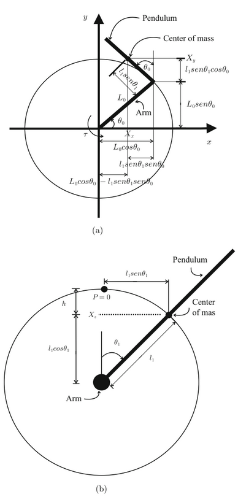
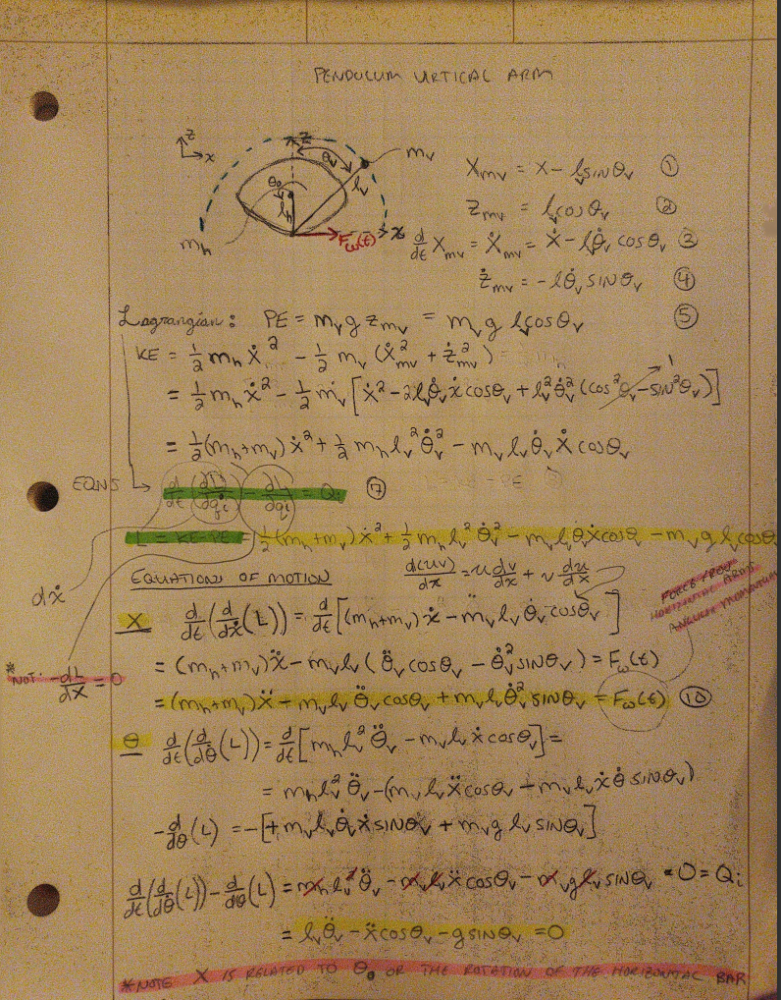
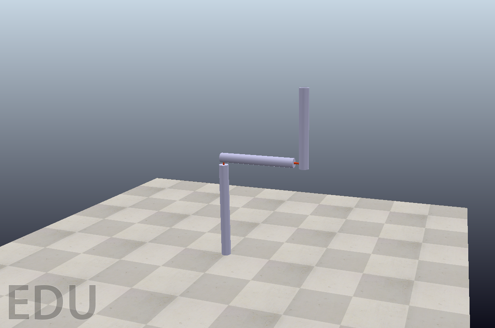

# MECH482-Group7-Project

 - Spring 2022 
 - Control System Design of Furuta Pendulum  
 - Group 7: Bryce Miller, Toto Albano-Dito, Angel Sanchez, Lucas West 

## Table of Context
+ [1 - Introduction](#Introduction) 
+ [2 - Modeling](#Modeling)
+ [3 - Preliminary Calculations](#Preliminary-Calculations)
+ [4 - Controller Design and Simulation](#Controller-Design-and-Simulation)
+ [5 - Appendix A Simulation Code](#Appendix-A-Simulation-Code)
+ [6 - References](#References)

### Introduction

#### Project
The Furuta Pendulum (rotational inverted pendulum) is a device that balances a free rotating pendulum in the vertical plane by a drive arm which rotates in the horizontal plane. The goal of this project is to create a Furuta Pendulum simulation by creating a control algorithm through matlab and modeling on Coppelia Sim. The Pendulum beam will be balanced upright perpendicular to the base of the ground by a control system. the project will be virtual and not an actual product will be made. 

  

#### Deliverables 
- The team is expected to present their project (~ 5mins) and build a web page which contains all deliverables in GitHub.
- The mathematical model of the system must be delivered -preferably in Python or MATLAB.
- The control system should be provided preferable in Simulink, State-flow, or with a high-level
  programming language (e.g., C, C++, or Python). However, the team must show that the control algorithm will 
  give the design requirements for the target system. In other words, one cannot
  build the system solely hands-on approach similar to the videos below:
  o Pan and Tilt Mechanism
- The system will have a simulation with the control system and mathematical model by
  connecting Coppelia Sim to MATLAB, Simulink, or whatever the programming landscape is used.
- If the system contains hardware, the design of hardware should consist the necessary
  architectural explanations such as hardware and software relationships.

### Modeling

#### Logical Viewpoint

#### Operational Viewpoint

### Preliminary Calculations

Figure 1. System Model

The futura pendulum system model is shown above. The moving arm utilizes the SRV02, which is the Quanser QUBE-Servo 2. This is how the arm actuates.

Variables of Figure 1.
- Lr = arm length
- Jr = Moment of Inertia
- θ = Angle of Jr
- Lp = Total Length
- Lp/2 = Center of Mass
- Jp = Moment of Inertia of the Center of Mass

### Controller Design and Simulation 

Figure 1. CoppeliaSim Model

The modelling of the Furuta Pendulum is implemented with CoppeliaSim, which has the ability to compute dynamic properties needed in operation of the pendulum arm.

### Appendix A Simulation Code

### References 
1) https://www.youtube.com/watch?v=o5g-lUuFgpg 
2) https://en.wikipedia.org/wiki/Furuta_pendulum
3) Hernández-Guzmán Victor Manuel., & Silva-Ortigoza Ramón. (2019). Automatic control with experiments. Springer International Publishing.

